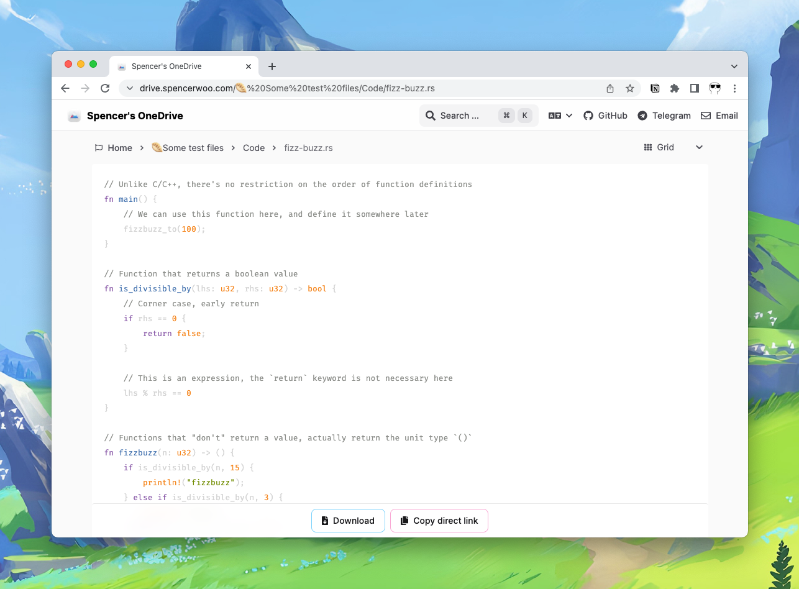
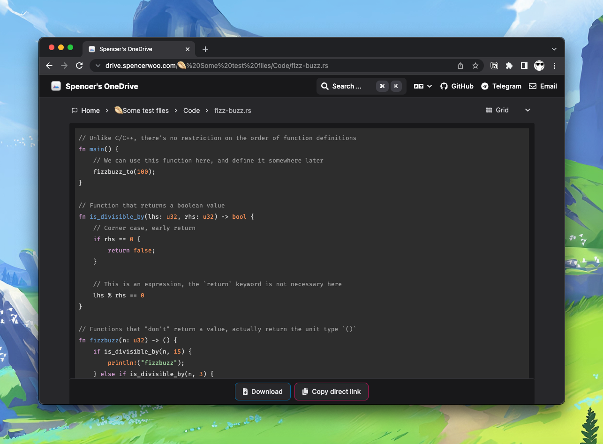
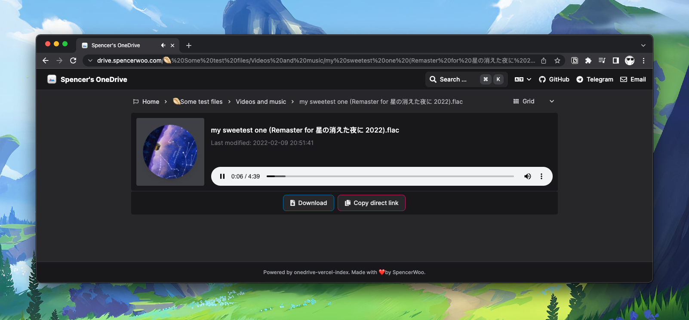
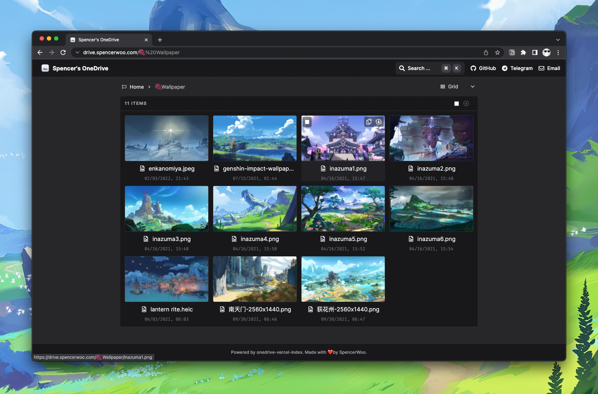
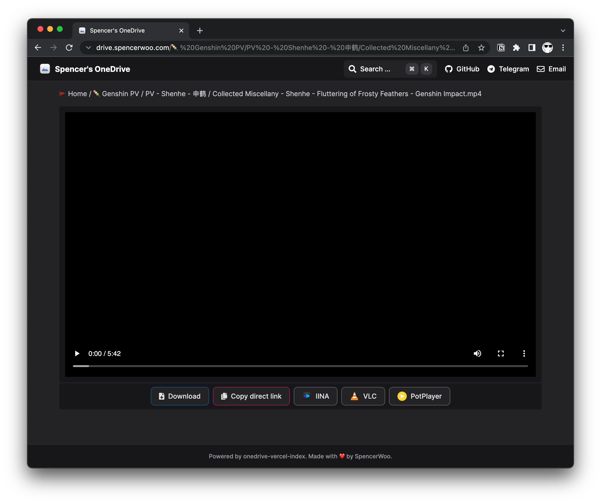
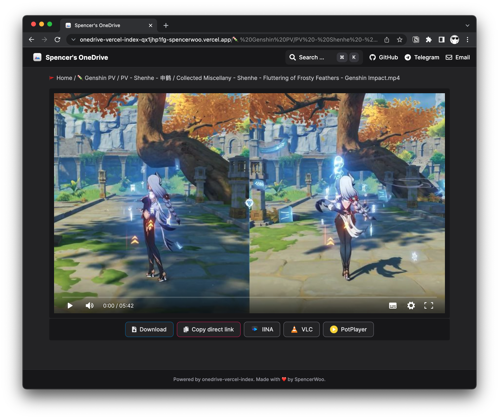
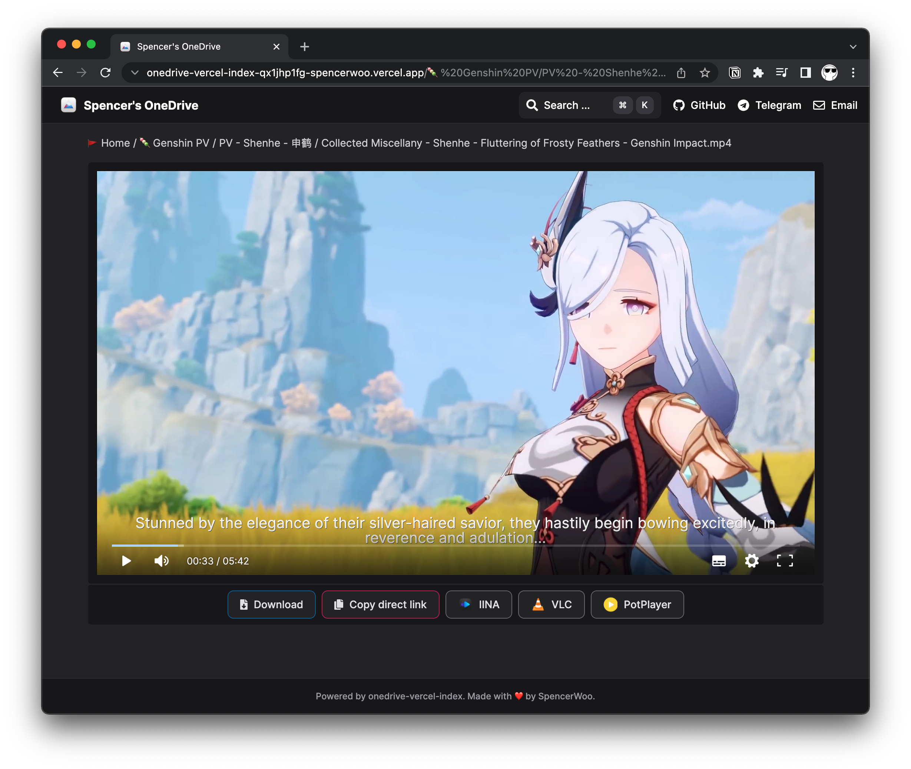
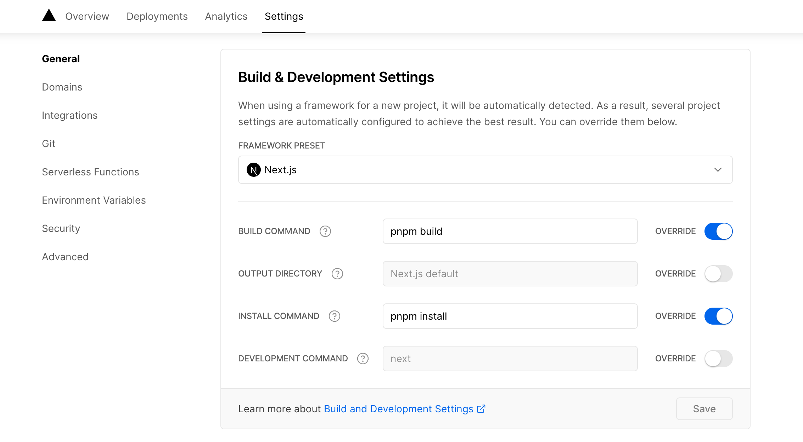

# What's new?

🎉 This is a constantly updating page of new updates for this project. Also available at [What's new? #325](https://github.com/spencerwooo/onedrive-vercel-index/discussions/325).

#### 2022/2/14 💞

- Other than password protected routes, and raw file link redirect API, all other API routes are using Vercel edge caching mechanisms (fresh for 60 seconds):

  ```
  Cache-Control: max-age=0, s-maxage=60, stale-while-revalidate
  ```

- Raw file link redirect API changed from `/api?path=<file>&raw=true` to `/api/raw?path=<file>`, no cache applied.
- Raw file link redirect API accepts the URL parameter `&odpt=<hashed_token>` for password authentication.

#### 2022/2/10

- 🚀 A few performance boosts:
  - Thumbnails are now requested separately after files are initially loaded. This improves file load performance as we are requesting fewer items from OneDrive's API on initial request. (However your thumbnails may load slower for half a second or so.)
  - **Edge caching is now in use:** we are now leveraging Vercel's edge function caching and `stale-while-revalidate` options, so you should experience extremely faster load speed for all API routes.) **Cache is valid for 60 seconds on the edge.** Check: [🚀 Edge caching #407](https://github.com/spencerwooo/onedrive-vercel-index/discussions/407).
- 👨‍💻 Code highlighting: we dropped dependency `Prism.js`, syntax highlighting is now performed by `react-syntax-highlighter` (using `highlight.js` under-the-hood. Support for different languages are imported asynchronous (so you may see a slight delay before the code is actually highlighted).

  |                              Light                              |                             Dark                              |
  | :-------------------------------------------------------------: | :-----------------------------------------------------------: |
  |  |  |

- 🎸 Audio preview (music player) now shows the thumbnail of the album if available.

  

#### 2022/2/8

- 🇨🇳/🇬🇧 - Project is i18n-ed, enjoy. 🥱
- 🎥 `.flv` videos are now supported.
- 🔗 Links copied to your clipboards are now formatted in a human-readable way.

  ```diff
  - before: /api?path=/%F0%9F%8E%BB%20Genshin%20playlist/%E3%80%90%E5%8E%9F%E7%A5%9E%E3%80%91%E8%83%A1%E6%A1%83%EF%BC%9A%E5%95%8A%E5%AF%B9%E5%AF%B9%E5%AF%B9%E5%AF%B9.mp4&raw=true
  + after:  /api?path=/🎻%20Genshin%20playlist/【原神】胡桃：啊对对对对.mp4&raw=true
  ```

- 📅 You can now customise your date formats in `site.config.js` under `datetimeFormat`.

#### 2022/2/5

- 💠  Layout switching is now supported! Grid layouts with thumbnail previews are now available.

  

- 🗑 We have dropped usage of `react-viewer` which is unperformant and causes high CPU usages.

#### 2022/2/2

- 🎥 We have dropped usage of `react-player` and is now using `react-dplayer` and `react-audio-player` as video and audio players respectively.
- 🎇 We added thumbnail rendering for videos, see the difference:

  |                                  Before                                  |                                After                                |
  | :----------------------------------------------------------------------: | :-----------------------------------------------------------------: |
  |  |  |

- 💬 We added support for subtitles (closed captions), which are auto referenced if a valid subtitle file with the same name as the video and in `.vtt` webvtt format is present.

  |                                 Before                                  |                                    After                                     |
  | :---------------------------------------------------------------------: | :--------------------------------------------------------------------------: |
  |  |  |

- ⚡️ We have migrated from `npm` to `pnpm` as project's package manager for faster build speed and more efficient cache usage. You may need to update your Vercel's build commands:

  

  - Build command: `pnpm build`
  - Install command: `pnpm install`

#### 2022/1/29

- ❗**Breaking** - Config files changed from `.json` to `.config.js`, relevant comments added. You can now move `userPrincipleName` to Vercel's environment variables (to avoid exposing your email address publicly).
- CORS headers are now present in ~~`?raw=true`~~ `/api/raw` routes for OneDrive raw file links.

#### 2022/1/22

- 🔍 [Supporting search for all versions of OneDrive #295](https://github.com/spencerwooo/onedrive-vercel-index/discussions/295)

#### 2022/1/11

- 📚 [New documentation site live #264](https://github.com/spencerwooo/onedrive-vercel-index/discussions/264)

#### 2022/1/10

- 🚫 Removed support for proxied download because of Vercel restrictions: [Proxied download not working - 无法使用代理下载 #251](https://github.com/spencerwooo/onedrive-vercel-index/discussions/251).

#### 2022/1/1

- 🚀 We now no longer need extra deployment tokens/secret setups: [New version update: No extra deployment setup is required anymore! #215](https://github.com/spencerwooo/onedrive-vercel-index/discussions/215)
