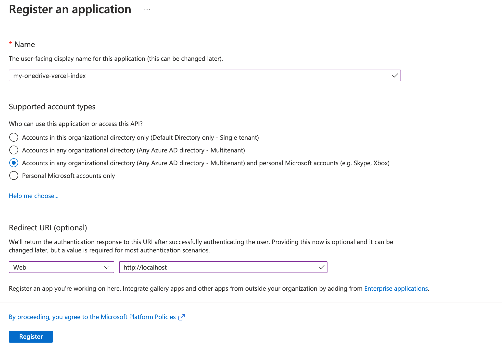
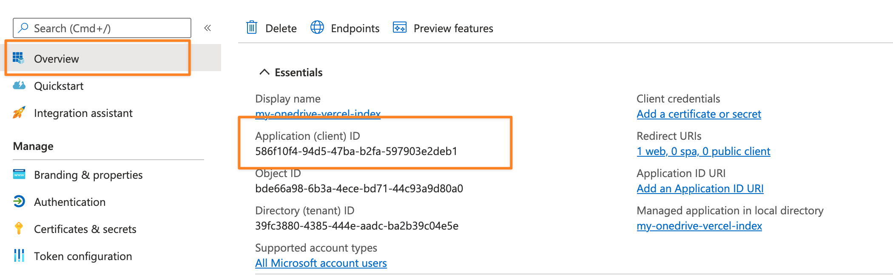
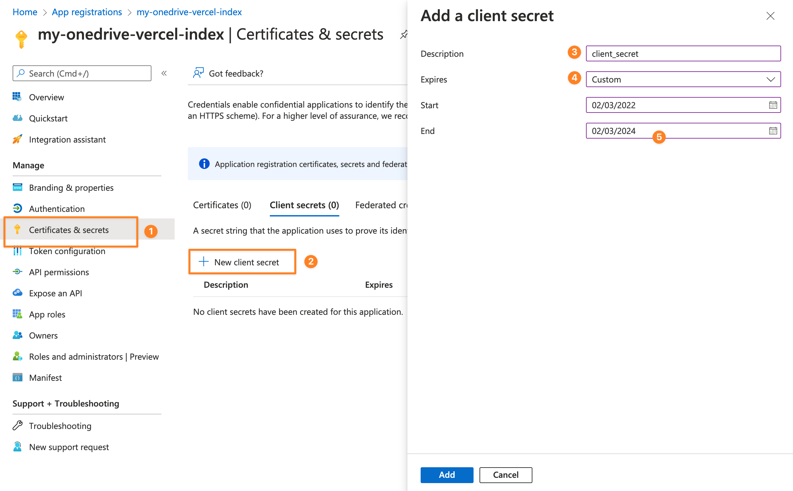
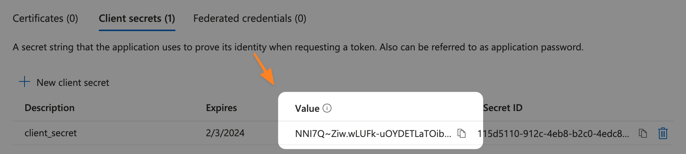
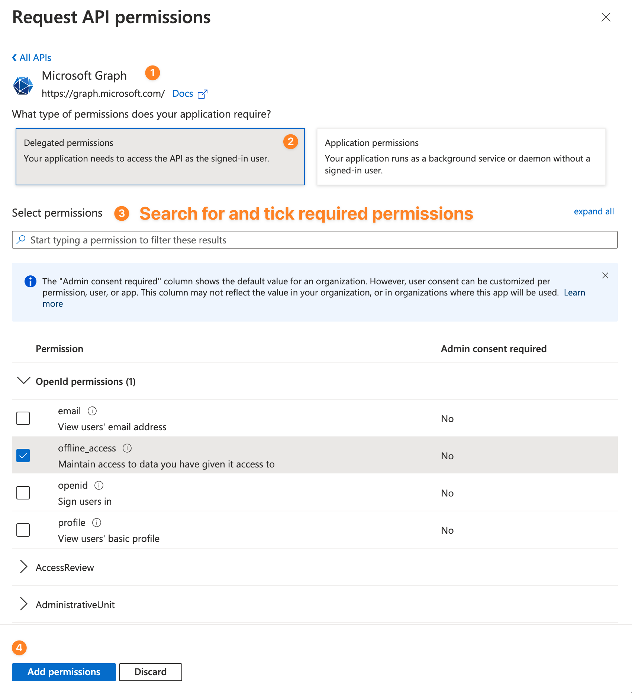

import Callout from 'nextra-theme-docs/callout'
import Encryption from '../../components/encryption'

# 高级

<Callout emoji="♻️">此页持续更新中。</Callout>

这里有些高级设置，你可能需要了解一下。

## 使用你自己的 client id 与 secret

如果你的账户没有管理权限，那么你就无法使用项目提供的 `clientId` 与 `clientSecret`。这个情况下，你就要生成你自己的 client id 与 secret 了。

### 注册一个应用程序

打开以下链接：

- [Microsoft Azure App registrations](https://portal.azure.com/#blade/Microsoft_AAD_RegisteredApps/ApplicationsListBlade)（ OneDrive 国际版、企业版与教育版，E5 订阅专用）
- [Microsoft Azure.cn App registrations](https://portal.azure.cn/#blade/Microsoft_AAD_RegisteredApps/ApplicationsListBlade)（OneDrive 世纪互联专用）

创建一个应用程序：

1. 登入你的微软账户，点击 _New registration_。
2. 输入一个名字，例如 my-onedrive-vercel-index。
3. 将 _Supported account types_ 设置为：

   ```
   Accounts in any organizational directory (Any Azure AD directory - Multitenant) and personal Microsoft accounts (e.g. Skype, Xbox)
   ```

   OneDrive 世纪互联用户设置为 - 任何组织目录（任何 Azure AD 目录 - 多租户）中的帐户。

4. 将 _Redirect URI (optional)_ 设置为 `Web`（在下拉菜单里）以及 `http://localhost`。
5. 点击注册。



### 获取你的 client id 与 secret

你的应用 (client) ID 就是 `api.config.js` 里的 `clientId` ，它应该出现在 _Overview_ > _Essentials_。



你的 client secret 需要手动获取

1. 点击 _Certificates & secrets_。
2. 点击 _New client secret_。
3. 创建一个新 secret ，描述为 `client_secret`。
4. 将 _Expires_ 设置为 `Custom`。
5. 将 _Start_ 与 _End_ 设置为能设置的最长时间。



最后，点击 _Add_ ，然后复制 client_secret 的值并妥善保管。（只有一次复制机会）



### 修改 API 权限

Microsoft Graph API 可以设置 API 范围，我们只需要以下三个（ `api.config.js` 里要求的）：

```
user.read files.read.all offline_access
```

点击 _API permissions_，再点击 _Microsoft Graph_，再点击 _Delegated permissions_，然后搜索：

- User.Read（这应该一开始就勾上了）
- Files.Read.All
- offline_access

选择全部三个并点击 _Add permissions_。



<Callout>现在，你就准备好你自己的 `clientId` 与 `clientSecret` 了。</Callout>

### 修改 `api.config.js`

你可以直接将 `clientId` 修改为你自己的 `clientId`。

但是，client secret 需要保密，你需要在下面进行 AES 加密：

<Encryption />

填写 client secret 后，你应该得到一个长得像这样的字符串：

```
U2FsdGVkX1830zo3/pFDqaBCVBb37iLw3WnBDWGF9GIB2f4apzv0roemp8Y+iIxI3Ih5ecyukqELQEGzZlYiWg==
```

将它替换到 `obfuscatedClientSecret` 里。

如果你修改了 `redirectUri` 为其他值，你也要在 `api.config.js` 里设置好。

<Callout emoji="🗣">
  详情请参考 [关于使用自己的 secret 进行 AES 加密方式的小白解决办法](https://github.com/spencerwooo/onedrive-vercel-index/discussions/234)。
</Callout>

## 自定义域名

详情请参考 [Custom Domains - Vercel](https://vercel.com/docs/concepts/projects/custom-domains)。
