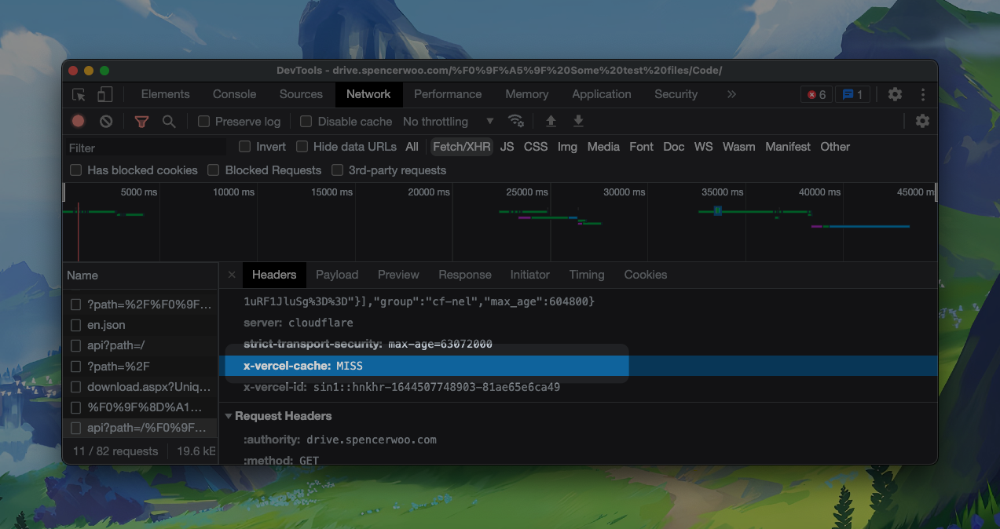
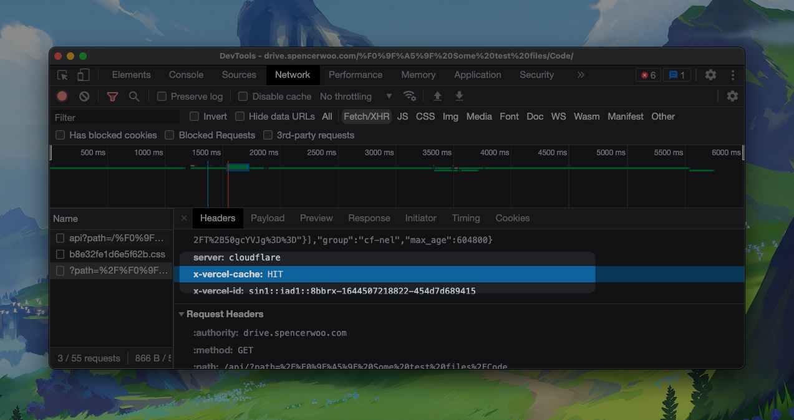
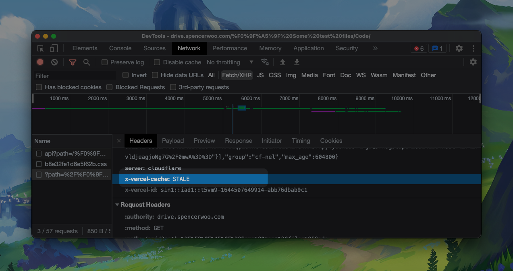

# 缓存

## Super fast?

Yes! Folder listing, thumbnail, search, etc., are now cached with Vercel's edge function caching. You should experience extremely faster load speed for these routes, especially folder listings. _(Note: the thumbnails themselves are not cached to follow Vercel's fair use policy, only the URL pointing to the thumbnails are cached.)_

**The cache is valid for 60 seconds on the edge** - This means you won't see your newly added files for at least 60 seconds after your files are done uploading.

If you want to manually purge the cache of your site, you can do so by triggering a redeployment manually.

> The cache is automatically purged upon a new deployment being created. If you ever need to invalidate the CDN cache, you can always re-deploy. Further reading: [Caching - Vercel Docs](https://vercel.com/docs/concepts/edge-network/caching).

## Technical details

Relevant headers:

```
Cache-Control: max-age=0, s-maxage=60, stale-while-revalidate
```

- `max-age=0` - no cache for your browser
- `s-maxage=60` - cache remains fresh for 60 seconds on the edge
- `stale-while-revalidate` - allow serving stale cache after 60 seconds while the edge revalidates the cache

You can check for response headers `x-vercel-cache` to see whether your request is responsed by a cache hit (fast 🐰), or fresh revalidated data (slow 🐢).

### Cache miss

Most often, no cache is present at the edge when someone first visits a route. This is presented as _cache miss_, where the response header `x-vercel-cache` is set to `MISS`. In this scenario, fresh data is requested from the upstream API, and you will experience a slow load speed (compared to other scenarios).



### Cache hit

After the route is requested, Vercel will cache the function response at the edge. When a second request on the same route is triggered, Vercel will respond with the cache instead of requesting data from the upstream for a second time. This is presented as _cache hit_, where the response header `x-vercel-cache` is set to `HIT`. You will experience an instant response.



### Cache stale

If the cache is present for longer than 60 seconds, on the request triggered, Vercel will respond with the stale cache, setting `x-vercel-cache` to `STALE`, and perform a new request to the upstream API. In this case, the following response is most likely guaranteed to be fresh, and Vercel will update the cache on the edge accordingly. You will experience an instant response for both requests.


