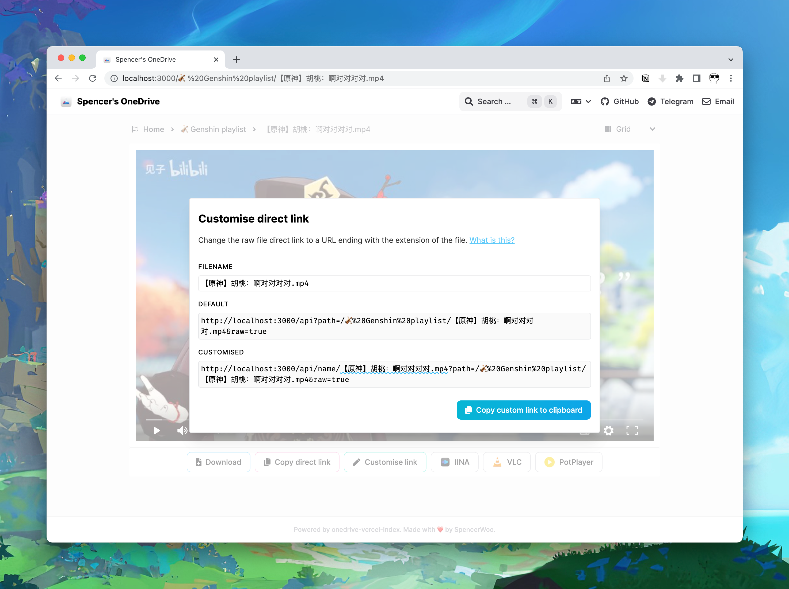

# Customise direct link

## TL;DR

You can add the filename (or any name) along with the extension of the file to the end of the your file's direct link. So, what was originally:

```
https://drive.swo.moe/api/raw/?path=/🎻%20Genshin%20playlist/【原神】胡桃：啊对对对对.mp4
```

... can also be written as:

```
https://drive.swo.moe/api/name/【原神】胡桃：啊对对对对.mp4?path=/🎻%20Genshin%20playlist/【原神】胡桃：啊对对对对.mp4
```

## Notes

- The parameter `name` can be literally anything and it will not affect the direct link.
- The parameter `path` is the path of the file in the drive, and the `/api/raw` route redirects you to the direct link of the file.
- We are only using the parameter `name` to add a valid filename and extension into the API request, so that the URL ends with the filename. (Query parameters does not count.)



## Why?

In order to embed your files, especially videos, into some services (e.g. [Notion](https://notion.so)), the file extension is required to be present in the URL, so that the service can identify the resource correctly.

Some related discussions:

- [有没有图床功能？ #290](https://github.com/spencerwooo/onedrive-vercel-index/discussions/290)
- [Support custom url final component name for Notion #306](https://github.com/spencerwooo/onedrive-vercel-index/pull/306)
