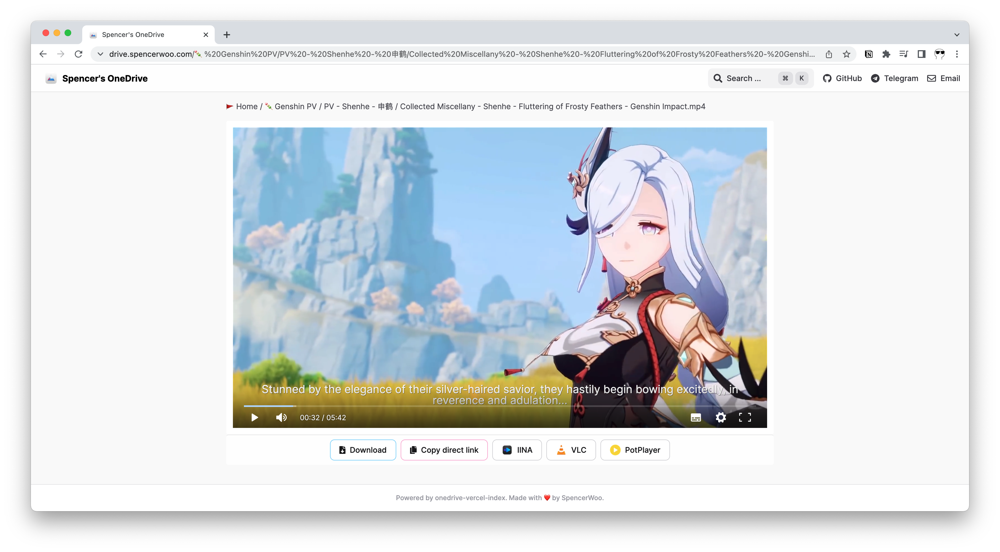

import Callout from 'nextra-theme-docs/callout'

# Load video subtitles

<Callout emoji="‼️" type="warning">Only WebVTT subtitle files (with `.vtt` extensions) are supported.</Callout>

If you have a [WebVTT](https://www.w3.org/TR/webvtt1/) subtitle or closed caption file (which ends in `.vtt`) for a certain video, you can use it by putting your subtitle file next to your video.



See this for an example:

- Folder holding the video and subtitle: [🍡 Genshin PV / PV - Shenhe - 申鹤](https://drive.swo.moe/%F0%9F%8D%A1%20Genshin%20PV/PV%20-%20Shenhe%20-%20%E7%94%B3%E9%B9%A4)
- The video with subtitles: [Collected Miscellany - Shenhe - Fluttering of Frosty Feathers - Genshin Impact.mp4](https://drive.swo.moe/%F0%9F%8D%A1%20Genshin%20PV/PV%20-%20Shenhe%20-%20%E7%94%B3%E9%B9%A4/Collected%20Miscellany%20-%20Shenhe%20-%20Fluttering%20of%20Frosty%20Feathers%20-%20Genshin%20Impact.mp4).

Basically, your video and cooresponding subtitle file should be in the same folder, and named as:

```
.
├── <THE_NAME_OF_YOUR_VIDEO_FILE>.mp4
└── <THE_NAME_OF_YOUR_VIDEO_FILE>.vtt
```

Such as:

```
.
├── Collected Miscellany - Shenhe - Fluttering of Frosty Feathers - Genshin Impact.mp4
└── Collected Miscellany - Shenhe - Fluttering of Frosty Feathers - Genshin Impact.vtt
```
