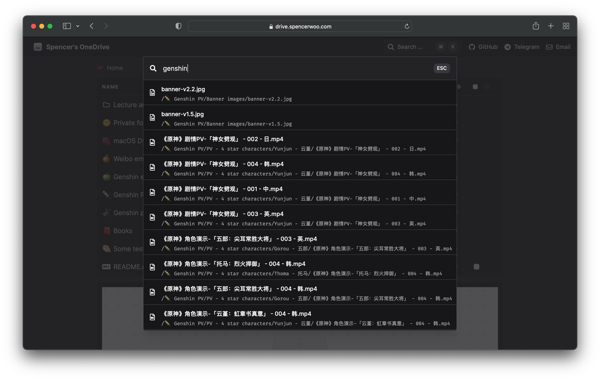

import Callout from 'nextra-theme-docs/callout'

# Search for files and folders

Native search is now supported! Use `Ctrl` or `⌘ + K` to open the search box, and `ESC` to close.

## Caveats

- Limited support as the search provided by Microsoft Graph API is not ideal.
- Extremely limited support for CJK search.

## Security concerns

Besides caveats above:

- **Search results still include your protected directories**
- This means your **file names** (whether inside the protected folder or not) are exposed.
- Visitors still need to enter passwords if they want to access the protected file contents.

<Callout emoji="🗣">
  Discussion here: [Supporting search for all versions of OneDrive
  #295](https://github.com/spencerwooo/onedrive-vercel-index/discussions/295)
</Callout>
