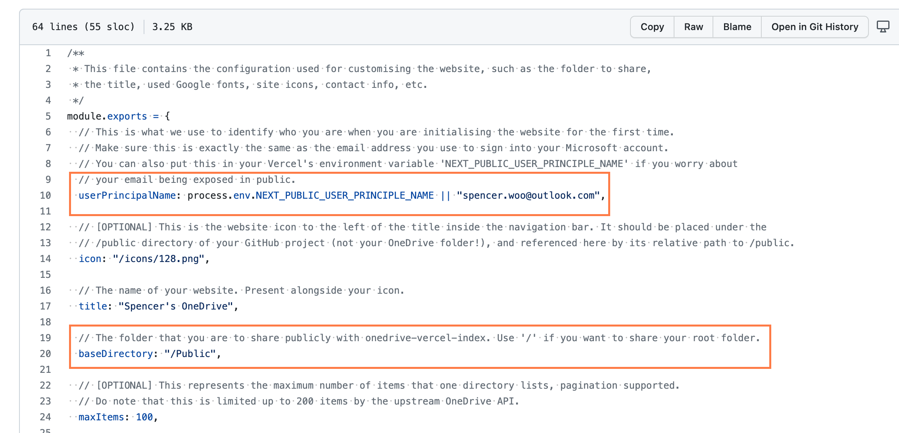
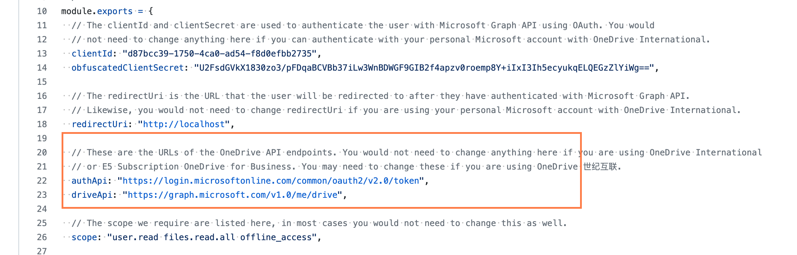
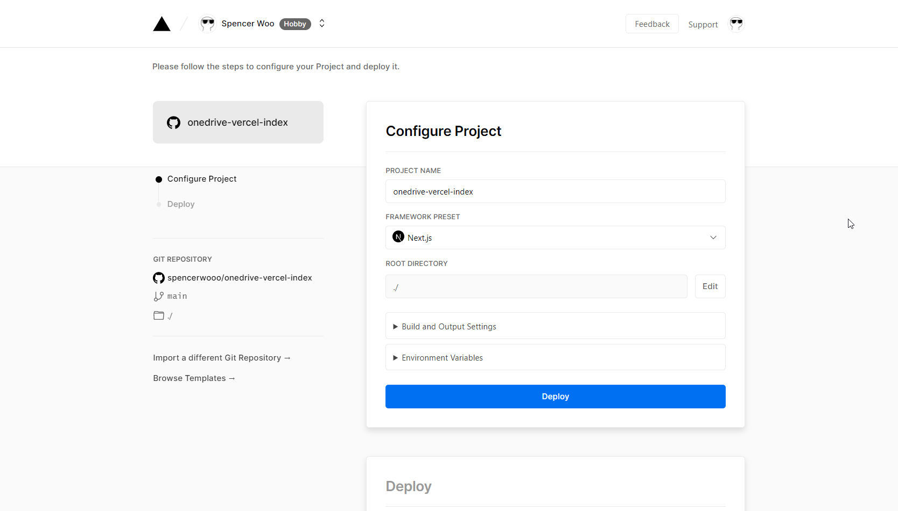
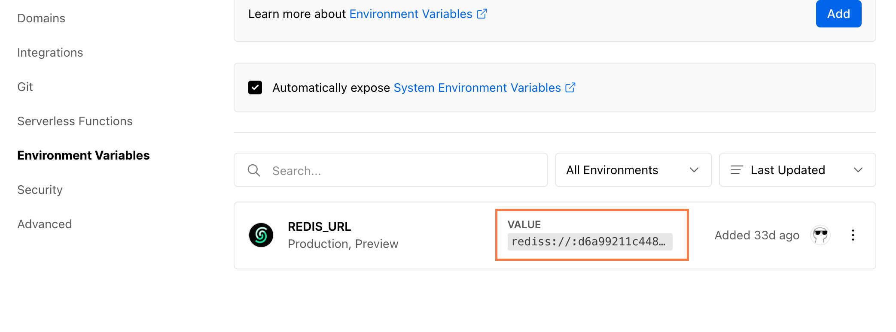
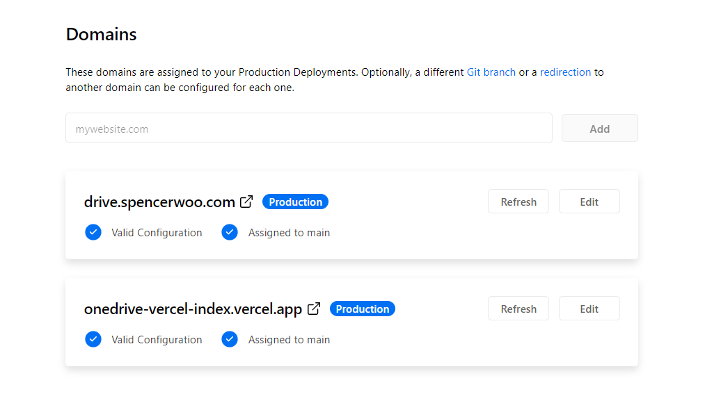
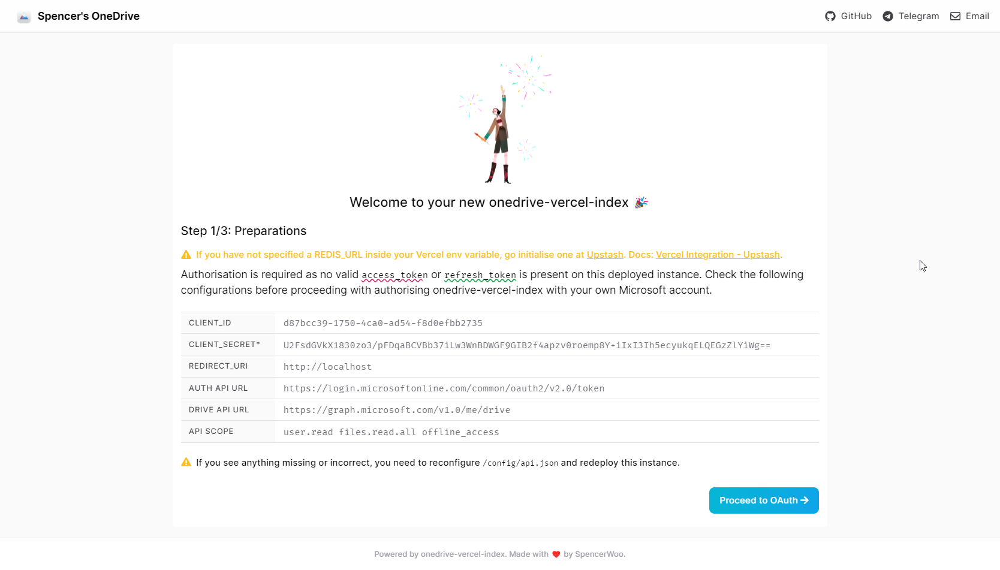
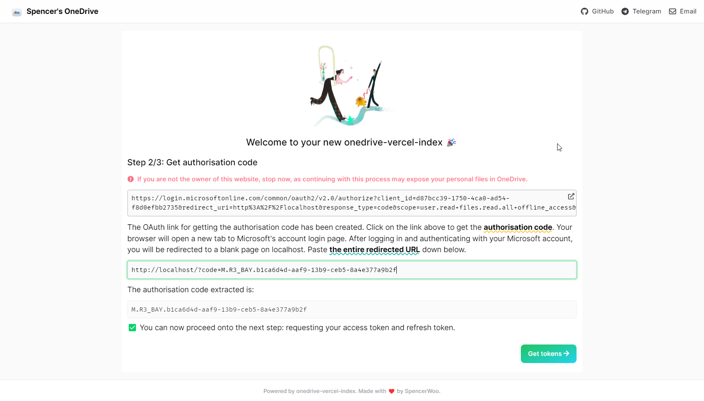

import Callout from 'nextra-theme-docs/callout'

# 立即上手

## 太长不看版

<Callout emoji="⚡️">这是一个简短的构建你自己的 onedrive-vercel-index 的指导。</Callout>

1. Fork [此项目](https://github.com/spencerwooo/onedrive-vercel-index)。
2. 将 `site.config.js` 里的 `userPrincipleName` 改为你的微软账户邮箱。
3. 将 `site.config.js` 里的 `baseDirectory` 修改为你要分享的文件夹路径。
4. 根据你的 OneDrive 版本示情况修改 `api.config.js`。
5. 将你的项目导入到 Vercel 并 [添加 Upstash 插件](https://vercel.com/integrations/upstash) 以更方便地设置 `REDIS_URL` 环境变量。
6. 部署，并享受！ 🎉

部署完成后的项目会引导你进行 OAuth 步骤，并自动将所需的凭证存储到 Redis 数据库里。这就是我们要做的全部事情！

## 立即上手（要来真的了！）

使用 onedrive-vercel-index 来共享、预览你的 OneDrive 里的文件、视频、音频、文档，并提供下载。


onedrive-vercel-index 本质上就是由 Next.js 构建的模板，你可以将其免费部署在 Vercel、Netlify 或者其他托管平台上。下面我们将 **完全从头开始** 创建你自己的 onedrive-vercel-index。

<Callout emoji="⚠️" type="warning">
  如果你在 2022 年之前部署过此项目，请参考 [迁移到 2022 年的新版本](./migration/if-you-deployed-before-2022)。
</Callout>

## Fork 此项目

将此项目 Fork 到你自己的 GitHub 账户中，因为你会需要维护一个包含你自己配置的项目。


## 修改设置

有些设置是需要修改的。项目包括两个配置文件，分别是 `config/site.config.js` 与 `config/api.config.js`。前者是用来定制你的网页的，后者那个是用来定义 API 参数的。

### 客制化网站

请根据自身情况修改 [`config/site.config.js`](https://github.com/spencerwooo/onedrive-vercel-index/blob/main/config/site.config.js)：

- `userPrincipalName` - 是用来在 OAuth 步骤时认证你的个人信息的。通常是你的 **微软账户邮箱**。
- `baseDirectory` - 是你要分享的 OneDrive 目录。你必须保证此目录有效且与此参数一致。（你可以直接在 OneDrive 内创建一个叫做 `Public` 文件夹，并将此项设置为 `/Public`。）



<Callout emoji="🍀">有些设置是为你自定义自己的网页而准备的，详情请参考 [自定义配置](./custom-configs)。</Callout>

### 修改 API 参数（可选项）

如果……

- 你是 **OneDrive 国际版用户**（不是 OneDrive 企业版或教育版，不是 SharePoint 用户，不是 E5 订阅用户），请直接忽略此步骤，不要碰 `config/api.config.js`。

如果不是，**或者你自己觉得真的有必要修改**：

- OneDrive 世纪互联使用了不同的 API 参数，所以我们要修改 `authApi` 和 `driveApi`

  

  将它们修改为：

  ```js
  authApi: "https://login.partner.microsoftonline.cn/common/oauth2/v2.0/token",
  driveApi: "https://microsoftgraph.chinacloudapi.cn/v1.0/me/drive",
  ```

  {/* 如果你需要使用代理下载功能，请修改 `directLinkRegex`。详情请参考 [Proxied download (disabled)](). */}

- OneDrive 企业版、教育版以及 E5 订阅的用户需要注意：先尝试在不修改 `config/api.config.js` 的情况下进行 OAuth **无论你是否有管理权限**。如果你被告知需要管理权限，你就要使用你自己的 `clientId` 与 `clientSecret` 了。详情请参考 [使用你自己的 clientid 与 secret](./advanced)。

## 导入到 Vercel 并部署

在 Vercel 导入 **你自己的** onedrive-vercel-index GitHub 项目，并进行以下设置：

- 修改 Build command 为 `pnpm build`.
- 修改 Install command 为 `pnpm install`.

<Callout>默认的也许能正常工作，但最好还是自定义这一项目。</Callout>



然后点击部署，Vercel 将会下载你的项目并进行部署。这次部署有可能会失败，这是因为我们还没有设定 `REDIS_URL` 环境变量。这就是我们接下来要做的。

### 连接到 Redis

创建一个 Redis 数据库，并且将数据库的访问链接填写到 Vercel 的 `REDIS_URL` 环境变量里。Redis 数据库是用于存储在 OAuth 时获取的 `access_tokens` 与 `refresh_tokens` 的。

- 我们推荐使用 **Upstash** ，它完全免费，并且与 Vercel 深度合作，详情请参考 [Vercel Integration](https://docs.upstash.com/redis/howto/vercelintegration)。（请忽略最后一步时让你 _Create Your Redis Client_ ，onedrive-vercel-index 已经为你处理好了）。
- 你可以使用你自己的 Redis 数据库，只要有 Vercel 能用的访问链接就行。

无论你用什么方式，你应该在 Vercel 的 `REDIS_URL` 环境变量里填好一个类似这样的 Redis URL：

```
redis://:xxx...@some-thing-like-35533.upstash.io:35533
```

如果你为 Redis 数据库启用了 [传输加密](https://docs.upstash.com/redis/howto/connectwithtls)：

```
rediss://:xxx...@some-thing-like-35533.upstash.io:35533
```



### 重新部署

最后，重新进行一次部署。并在部署完成后访问 Vercel 提供的链接，`onedrive-vercel-index` 将会引导你进行 OAuth 认证。你也可以在 Vercel 自定义访问链接，详情请参考 [自定义域名](./advanced)。



## 进行认证

访问你的 `onedrive-vercel-index` ，如果你从未进行认证，OAuth 认证将会自动开始。

### 第一步 - 准备工作



检查此页面上的参数是否正确，尤其是 `client_id` 与 `client_secret` （加密的），他们应该与你的项目里的一致。你还要检查一下 API 权限，应该只需要这三个：

- `user.read`: 在进行 OAuth 时认证你的身份，防止某些傻逼通过重新认证雷普你的项目。
- `files.read.all`: 用于访问你的 OneDrive 的文件
- `offline_access`: 就是……用来离线访问 🙃

如果一切都准备好了，就来到第二步。如果有些什么差错，检查你的 `config/api.config.js` 然后重新部署。

### 第二步 - 获取认证码



我们已经基于 `config/api.config.js` 给你准备好认证链接了。点击链接，你将会进入一个新标签页并进行登录。请确保你登陆的账户与你在 `config/site.config.js` 的 `userPrincipalName` 里设置的一致。

<Callout emoji="⚠️" type="warning">
  如果你的帐户没有管理权限，那么你需要使用你自己的 `client_id` 与 `client_secret`。详情请参考 [使用你自己的 clientid 与
  secret](./advanced)。
</Callout>

 URL that you would be redirected to](./_images/getting-started/step2-redirect-code-localhost.png)

完成登录后，你将会跳转到 `http://localhost` ，尽管它显示无法访问，你只需要复制地址栏中的地址然后粘贴到第二步的输入框里。onedrive-vercel-index 会自动识别用于获取 `access_token` 与 `refresh_token` 的认证码，然后点击 _Get tokens_ 就行。

### 第三步 - 获取凭证


你只需要等待几秒钟，页面上就会显示成功提示以及几行凭证，请点击 _Store tokens_ ，你的凭证就会保存到 Redis 数据库里。

<Callout emoji="📢">
  这个过程中我们一直在检查 **你的身份** ，所以如果出现了 "Don't pretend to be the site owner" 提示，请检查
  `config/site.config.js` 里的 `userPrincipalName`是否填写正确。
</Callout>

最后，你将会跳转到你全新的 onedrive-vercel-index ，完成！

<Callout emoji="⚠️" type="warning">
  如果你认证结束后被重新跳转到步骤一，而你确认一切都没有问题时，**请等待几秒并手动回到主页再刷新**，Redis 数据库存取凭证需要一点儿时间。
</Callout>
